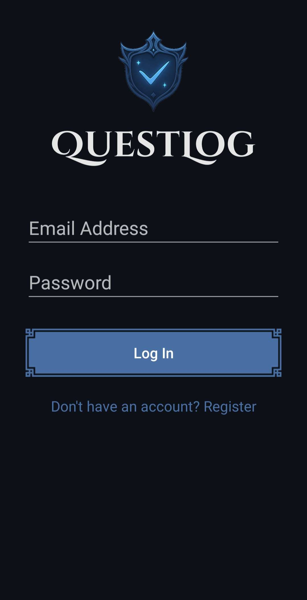

  

**QuestLog** je Android aplikacija za praćenje navika i ciljeva inspirisana RPG igrama.  
Korisnici kreiraju svakodnevne zadatke i navike koje im donose XP poene, otključavaju bedževe, dobijaju opremu i napreduju kroz nivoe – uz dodatni društveni aspekt kroz prijatelje i saveze.

> *Aplikacija je razvijena kao univerzitetski projekat, ali je u potpunosti funkcionalna i spremna za upotrebu.*

---

## Glavne funkcionalnosti

| Modul (funkcionalnost) | Opis |
|------------------------|------|
| **Upravljanje nalogom** | Registracija, prijava i odjava korisnika, verifikacija e-maila, izbor avatara. Profil sa XP, PP, titulom, bedževima, novčićima, QR kodom i opremom. |
| **Napredovanje kroz nivoe** | Skupljanje XP poena i prelazak nivoa prema definisanoj formuli. Automatsko dodeljivanje titule, PP poena i nagrada nakon svakog nivoa. Vizuelni prikaz napretka. |
| **Statistika korisnika** | Interaktivni grafikoni i vizuelizacije: broj dana korišćenja, završenih zadataka, niz uspešnosti, XP u poslednjih 7 dana, zadaci po kategorijama. |
| **Borba sa bosom** | Posle svakog nivoa korisnik se bori sa bosom čiji HP raste po formuli. Sistem napada sa procentom uspešnosti zavisno od rešavanja zadataka. Vizuelni prikaz HP bosa i PP korisnika. |
| **Rad sa opremom** | Aktivacija opreme pre borbe (napici, odeća, oružje). Kupovina u prodavnici, trajni i jednokratni bonusi, praćenje trajanja odeće i unapređenje oružja. |
| **Prijatelji i savezi** | Dodavanje prijatelja preko korisničkog imena ili QR koda. Kreiranje saveza i pozivanje prijatelja sa notifikacijama putem Firebase Cloud Messaging-a. |
| **Specijalne misije** | Zajedničke borbe saveza protiv bosa sa HP proporcionalnim broju članova. Zadaci saveza smanjuju HP bosa, a uspešno završene misije donose bedževe, opremu i novčiće. |

---

## Tehnologije i biblioteke

- **Java** – implementacija aplikacije  
- **Android Studio** – razvojno okruženje  
- **SQLite** – lokalna baza podataka  
- **Firebase** – autentikacija naloga i Firestore/Realtime Database  
- **Firebase Cloud Messaging (FCM)** – slanje push notifikacija (pozivi u savez, poruke)  
- **SharedPreferences** – čuvanje podešavanja aplikacije  
- **MPAndroidChart** – interaktivni grafikoni (statistika korisnika)  
- **Lottie** – animacije (otvaranje kovčega, uspešan udarac bosa, konfete)  
- **ZXing QR Code Scanner** – generisanje i skeniranje QR kodova korisnika  

# Pregled ekrana aplikacije

Svi screenshotovi podržavaju **svetli** i **tamni** režim (automatski prema podešavanju sistema).

---

## Autentikacija
| Registracija | Prijava | Profil |
|--------------|---------|--------|
| <picture><source srcset="screenshots/Register_dark.jpg" media="(prefers-color-scheme: dark)"><source srcset="screenshots/Register_light.jpg" media="(prefers-color-scheme: light)"></picture> | <picture><source srcset="screenshots/Login_dark.jpg" media="(prefers-color-scheme: dark)"><source srcset="screenshots/Login_light.jpg" media="(prefers-color-scheme: light)"></picture> | <picture><source srcset="screenshots/Profile_dark.jpg" media="(prefers-color-scheme: dark)"><source srcset="screenshots/Profile_light.jpg" media="(prefers-color-scheme: light)"></picture> |

---

## Društvene funkcije
| Prijatelji | Alijansa Info | Alijansa Chat |
|------------|---------------|---------------|
| <picture><source srcset="screenshots/Friends_dark.jpg" media="(prefers-color-scheme: dark)"><source srcset="screenshots/Friends_light.jpg" media="(prefers-color-scheme: light)"></picture> | <picture><source srcset="screenshots/AllianceInfo_dark.jpg" media="(prefers-color-scheme: dark)"><source srcset="screenshots/AllianceInfo_light.jpg" media="(prefers-color-scheme: light)"></picture> | <picture><source srcset="screenshots/AllianceChat_dark.jpg" media="(prefers-color-scheme: dark)"><source srcset="screenshots/AllianceChat_light.jpg" media="(prefers-color-scheme: light)"></picture> |

---

## Inventar i Shop
| Shop | Oprema |
|------|--------|
| <picture><source srcset="screenshots/Shop_dark.jpg" media="(prefers-color-scheme: dark)"><source srcset="screenshots/Shop_light.jpg" media="(prefers-color-scheme: light)"></picture> | <picture><source srcset="screenshots/Equipped_dark.jpg" media="(prefers-color-scheme: dark)"><source srcset="screenshots/Equipped_light.jpg" media="(prefers-color-scheme: light)"></picture> |

---

## Statistike
| Stats 1 | Stats 2 |
|---------|---------|
| <picture><source srcset="screenshots/Stats1_dark.jpg" media="(prefers-color-scheme: dark)"><source srcset="screenshots/Stats1_light.jpg" media="(prefers-color-scheme: light)"></picture> | <picture><source srcset="screenshots/Stats2_dark.jpg" media="(prefers-color-scheme: dark)"><source srcset="screenshots/Stats2_light.jpg" media="(prefers-color-scheme: light)"></picture> |

## Demo

